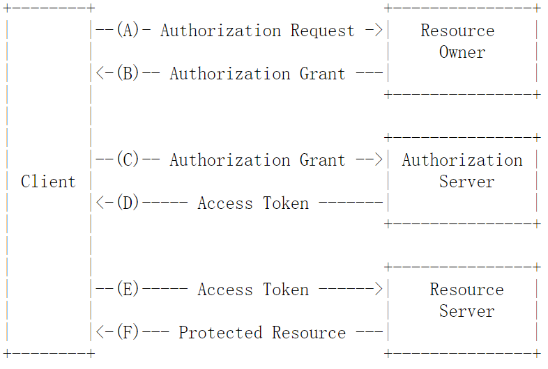
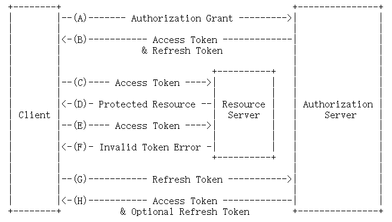

# OAuth 2.0 Authorization Framework

Abstract

The OAuth 2.0 authorization framework enables a third-party  application to obtain limited access to
an Http service, either on behalf of a resource owner by orchestrating an approval interaction between
the resource owner and the Http service ,or by allowing the third-party application to obtain access on
its own behalf. This specification replace and obsoletes the OAuth 1.0 protocol described i RFC 5849
Status of This Memo

This is an Internet Standards Track document.
This document is a product of the Internet Engineering Task Force
(IETF).  It represents the consensus of the IETF community.  It has
received public review and has been approved for publication by the
Internet Engineering Steering Group (IESG).  Further information on
Internet Standards is available in Section 2 of RFC 5741.

Information about the current status of this document, any errata,
and how to provide feedback on it may be obtained at
http://www.rfc-editor.org/info/rfc6749.
Copyright Notice

Copyright (c) 2012 IETF Trust and the persons identified as the
document authors.  All rights reserved.

This document is subject to BCP 78 and the IETF Trust's Legal
Provisions Relating to IETF Documents
(http://trustee.ietf.org/license-info) in effect on the date of
publication of this document.  Please review these documents
carefully, as they describe your rights and restrictions with respect
to this document.  Code Components extracted from this document must
include Simplified BSD License text as described in Section 4.e of
the Trust Legal Provisions and are provided without warranty as
described in the Simplified BSD License.

## 1 Introduction

In the traditional client-server authentication model, the client request access-restricted resourceon server by authenticating with server using the resource owner's credentials.
in order to provide third-party application access to restricted resource ,the resource owner shares its credentials with the third party.

this creates several problems and limitations:

1. Third-party applications are required to store the resource owner's credentials for future use, typically a password in clear-text.
2. Servers are required to support password authentication. despite the security weaknesses inherent in password.
3. Third-party application gain overly broad access to the resource owner's protected resources ,leaving resource owners without any ability to restrict duration or access to a limited subset of resources
4. Resource owners cannot revoke access to an individual third party without revoking access to all third parties.and must do so by changing the party's password
5. Compromise of any third-party application results in compromise of end-user's password and all of the data protected by that password.

OAuth address these issues by introducing an authorization layer and separating the role of the client from that of the  resource owner.
In oauth, the client request access to resource controlled by the resource owner and hosted by the resource server, and is issued a different
set of credentials than those of resource owner

Instead of using the resource owner's credentials to access protected resource, the client obtain an access token -- a string denoting a specific
scope, lifetime, and other access attributes. Access tokens are issued to third-party clients by an authorization server with the approval of the
resource owner. the client uses the access token to access the protected resources hosted by the resource server.

for example an end-user can grant printing service access to her protected photos stored at photo-sharing services, without sharing her username
and password with the printing service. instead, she authenticates directly with a server trusted by photo-sharing service ,with issues the printing
service (authorization server ) ,which issues the printing service delegation-specific credentials.

this specification is designed for use with http . the use of oauth over any protocol other than http is out of scope.

the oauth 1.0 protocol .published as an informational document, was the result of a small ad hoc community effort. this standard track specification builds
on the oauth1.0 deployment experience, as well as additional use cases and extensibility requirement gathered from the wider IETF community.  The OAuth 2.0  protocol is not backward compatible with OAuth 1.0.  The two versions   may co-exist on the network, and implementations may choose to  support both.  However, it is the intention of this specification  that new implementations support OAuth 2.0 as specified in this  document and that OAuth 1.0 is used only to support existing  deployments.  The OAuth 2.0 protocol shares very few implementation  details with the OAuth 1.0 protocol.  Implementers familiar with  OAuth 1.0 should approach this document without any assumptions as to  its structure and details

### 1.1 Roles

Oauth defines four roles:

1. resource owner
   an entity capable of granting access to a protected resource. when the resource owner is a person .it is referred to as an end-user.
2. resource server
   the server hosting the protected resources, capable of accepting and responding to protected resource request using access tokens
3. client
   an application marking protected resource requests on behalf of the resource owner and with its authorization. the erm "client" does not imply any particular implementation characteristics(e.g.,whether the application executes on a server, desktop,or other devices).
4. authorization server
   the server issuing access tokens to the client after successfully authenticating thr resource owner and obtaining authorization.

the interaction between the authorization server and resource server is beyond the scope of this specification. the authorization server may be the same server as the resource server or a separate entity. an single authorization server may issue access token accepted by multiple resource server

### 1.2 Protocol Flow

Figure 1: Abstract Protocol Flow

the abstract OAuth 2.0 flow illustrated in Figure 1 describes the interaction between the four roles and includes the following steps :

1. the client request authorization from the resource owner. the authorization request can be made directly to resource owner, or preferably indirectly via the authorization server as an intermediary
2. the client receives an authorization grant, which is a credential representing the resource owner's authorization, expressed using one of four grant types defined in this specification grant in this specification or using an extension grant type. the authorization grant type depends on the method used by the client to request authorization and the types supported by the authorization server.
3. the client requests an access token by authenticating with the authorization server and presenting the authorization grant.
4. the authorization server authenticates the client and validates the authorization grant, and if valid, issues an access token.
5. the client requests the protected resource from the resource from the resource server and authenticates by presenting the access token.
6. the resource server validates the access token, and if valid, serves the request.

the preferred method for the client to obtain an authorization grant from the resource owner is to use the authorization server as an intermediary, which is illustrated in Figure3 in Section 4.1

### 1.3
an authorization grant is a credential representing the resource owner's authorization used by the client to obtain an access token. the specification defines four grant types--authorization code, implicit, resource owner password credentials, and client credentials--as well as an extensibility mechanism for defining additional types.

1. authorization code
   the authorization code is obtained by using an authorization server as an intermediary between the client and resource owner. instead of requesting authorization directly from the resource owner, the client directs the resource owner to an authorization server (via its user-agent as defined in[RFC2616]), which in turn directs the resource owner back to the client with the authorization code.
   before directing the resource owner  back to the client with the authorization code,the authorization server authenticates the resource owner and obtains authorization. because the resource owner only authenticates with the authorization server,the resource owner;s credentials are never shared with the client.
   the authorization code provides a few important security benefits, such as the ability to authenticate the client, as well the transmission of the access token directly to the client without passing it through the resource owner;s user-agent and potentially exposing it to others,including the resource owner.

2. implicit
   the implicit grant is a simplified authorization code flow optimized for clients implemented in a browser using a scripting language such as javascript. in the implicit flow, instead of issuing the client an authorization code, the client is issued an access token directly(as the result of resource owner authorization). the grant type is implicit, as no intermediate credentials(such as authorization code) are issued(and later used to obtain an access token). 
   when issuing an access token during the implicit grant flow, the authorization server does not authenticate the client. in some case,the client identity can be verified via the redirection uri used to deliver the access token to the  client. the access token may be exposed to the resource owner or other application with access to the resource owner;s user-agent.
   implicit grants improve the responsiveness and efficiency of some clients(such as a client implemented as an in-browser application),since it reduces the number of round trips required to obtain an access token.however, this convenience should be weighed against the security implications of using implicit grants, such as those described in sections 10.3/10.4,especially when the authorization code grant type is available. 

3. resource owner password credentials
   the resource owner password credentials can be used directly as an authorization grant to obtain an access token.the credentials should only be used when there is a high degree of trust between the resource owner and the client(e.g., the client is part of the device operating system or a highly privileged application), and when other authorization grant types are not available.
4. client credentials
   the client credentials can be used as an authorization grant when the authorization scope is limited to the protected resources under the control of the client, or to protected resources previously arranged with the authorization server. client credentials are used as an authorization grant typically when the client is acting on its own behalf(the client is also the resource owner) or is requesting access to protected resources based on an authorization previously arranged with the authorization server.

### 1.4
access token are credentials used to access protected resources. an access token is a string representing an authorization issued to the client. the string is usually opaque  to the client. tokens represent specific scopes and durations of access, granted by the resource owner,and enforced by the resource server and authorization server.
the token may denote an identifier used to retrieve the authorization information or may self-contain the authorization information in a verifiable manner(i.e.,a token string consisting of some data and a signature). additional authentication credentials, which are beyond the scope of this specification, may be required in order for the client to use a token.

the access token provides an abstraction layer, replacing different authorization constructs(e.g., username and password)with a single token understood by the resource server. this abstraction enables issuing access tokens more restrictive than the authorization grant used to obtain them, as well as removing the resource server's need to understand a wide range of authentication methods.

access tokens an have different formats,structures,and methods of utilization(e.g., cryptographic properties) based on the resource server security requirements. access token attributes and the methods used to access protected resources are beyond the scope of this specification and are defined by companion specifications 

### 1.5
refresh tokens are credentials used to obtain access tokens. refresh tokens are issued to the client by the authorization server and are used to obtain a new access token when the current access token becomes invalid or expires, or to obtain additional access tokens with identical or narrower scope(access tokens may have a shorter lifetime and fewer permissions than authorized by the resource owner).issuing a refresh token is optional at the direction of the authorization server. if authorization server issues a refresh token, it is included when issuing an access token.

a refresh token is a string representing the authorization granted to the client by the resource owner.
the string is usually opaque to the client. the token denotes an identifier used to retrieve the authorization information. unlike access tokens, refresh tokens are intended for use only with authorization servers and never sent to resource servers.

### 1.6

whenever transport layer security is used by this specification, the appropriate of tls will vary over time , based on the widespread deployment and know security vulnerabilities. at the time of this  writing,tls version 1.2 is the most recent version, but has a very limited deployment base and might not be readily available for implementation. tls version 1.0 is the most widely deployed version and will provide the broadest interoperability.
implementations may also support additional transport-layer security mechanisms that meet their security requirements.

### 1.7

this specification makes extensive use of http redirection, in which the client or the authorization server directs the resource owner's user-agent to another destination. while the example in this specification show the use of the http 302 status code, any other method available via the user-agent to accomplish this redirection is allowed and is considered to be an implementation detail

### 1.8

Oauth2.0 provides a rich authorization framework with well-defined security properties. however, as a rich and highly extensible framework with many optional components, on its own, this specification is likely to produce a wide range of non-interoperable implementations.

in addition, this specification leaves a few required components partially or fully undefined. without these components,clients must be manually and specifically configured against a specific authorization server and resource server in order to interoperate.

this framework was designed with the clear expectation that future work will define prescriptive profiles and extensions necessary to achieve full web-scale interoperability.

### 1.9

The key words "MUST", "MUST NOT", "REQUIRED", "SHALL", "SHALL NOT",
   "SHOULD", "SHOULD NOT", "RECOMMENDED", "MAY", and "OPTIONAL" in this
   specification are to be interpreted as described in [RFC2119].
Certain security-related terms are to be understood in the sense
   defined in [RFC4949].  These terms include, but are not limited to,
   "attack", "authentication", "authorization", "certificate",
   "confidentiality", "credential", "encryption", "identity", "sign",
   "signature", "trust", "validate", and "verify".

Unless otherwise noted, all the protocol parameter names and values
   are case sensitive.

## 2 Client Registration

before initiating the protocol, the client register with the authorization server.
the means through which the client registers with the authorization server are beyond the scope of this specification but typically involve end-user interaction with an html registration from.

client registration does not require a direct interaction between the client and the authorization server. when supported by the authorization server, registration can rely on the means for establishing trust and obtaining the required client properties. for example, registration can be accomplished using a self-issued or third-party-issued assertion,or by the authorization  server performing client discovery using a trusted channel.

when registering a client, the client developer shall:
   1. specify the client types as described in https://datatracker.ietf.org/doc/html/rfc6749#section-2.1
   2. provide its clients redirection uris as described in https://datatracker.ietf.org/doc/html/rfc6749#section-3.1.2
   3. include any other information required by the authorization server
      (e.g., application name, website, description, logo image, the
      acceptance of legal terms).

### 2.1 Client Type

Oauth defines two clients types, based on their ability to authenticate securely with the authorization server:

confidential 
   clients capable of maintaining the confidentiality of their credential